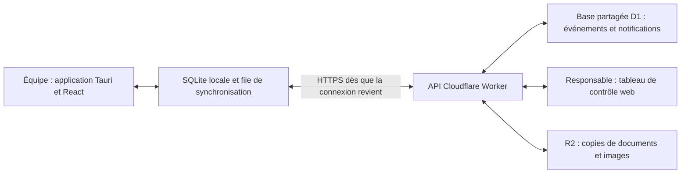

# Application de facturation et tableau de contrôle

## Deux usages, une entreprise

- Équipe : factures, clients et paiements dans une application de bureau utilisable hors connexion.
- Responsable : tableau de contrôle web, états connus des comptes clients, fraîcheur des données et demandes adressées à l’équipe.
- Serveur partagé : reçoit les événements, calcule les états connus et conserve les demandes jusqu’à leur réception par le poste concerné.

Le site actuel est une démonstration statique. Son stockage de navigateur ne constitue pas une synchronisation. Le tableau de contrôle réel demande une API authentifiée et une base partagée ; l’application de bureau n’est pas encore présente dans le dépôt.

## Composition proposée

Le Rust porte les opérations locales, le stockage et la synchronisation ; React conserve l’interface existante. Cloudflare Workers et D1 constituent une option de serveur, R2 une option pour les fichiers. Le plan gratuit reste à confirmer selon le volume réel ; la présence d’une offre gratuite ne garantit pas une exploitation sans coût ni sans quotas. La publication Sites actuelle n’est pas le compte Cloudflare personnel du client.

Références officielles consultées : [Workers : limites](https://developers.cloudflare.com/workers/platform/limits/), [D1 : limites](https://developers.cloudflare.com/d1/platform/limits/), [Tauri : stockage SQL/SQLite](https://v2.tauri.app/plugin/sql/).

## Informations du tableau de contrôle

Pour chaque client : total facturé, avoirs, paiements enregistrés, reste à recevoir, factures associées, état de transmission déclaré des documents et dernière mise à jour reçue.

Une facture émise ou imprimée n’est pas une preuve que le client l’a reçue. Les états doivent distinguer « émise », « remise déclarée par l’équipe » et « réception confirmée », cette dernière exigeant une confirmation identifiable. Les paiements conservent montant, date, mode, référence, auteur et identifiant de facture.

Pour chaque poste : nom, dernière communication, dernière synchronisation complète et éventuelle erreur connue. Le serveur ne connaît pas le nombre de modifications encore locales tant que le poste ne le lui a pas transmis. Une absence de communication récente signifie « données potentiellement incomplètes », pas la certitude que le paiement a été oublié.

## Demande de vérification d’un paiement

1. Le responsable ouvre le client et la facture concernée.
2. Il voit les paiements connus et la date de dernière synchronisation.
3. Il adresse une demande avec montant, date, mode et référence éventuelle.
4. Le serveur conserve la demande : **Envoyée**.
5. Au prochain contact, l’application reçoit la demande et accuse réception : **Reçue sur le poste**.
6. L’équipe ouvre la demande : **Lue**.
7. Elle vérifie les écritures puis rattache un paiement existant ou en enregistre un nouveau : **Traitée**, avec référence au paiement et auteur.

La demande n’est pas un paiement : elle ne modifie jamais automatiquement le solde. Si une écriture identique existe déjà, l’équipe la rattache plutôt que créer un doublon. Une demande peut aussi être traitée avec une réponse expliquant qu’aucun paiement n’est confirmé. L’historique reste conservé.

Une messagerie générale n’est pas nécessaire pour la première version ; un fil de demandes lié au client ou à sa facture couvre ce flux. Les réponses et les accusés restent disponibles après fermeture de l’application.

## Synchronisation

- Chaque opération locale crée un événement durable avec UUID, entreprise, poste, auteur, date locale et ordre local, enregistré atomiquement avec le changement métier.
- Le poste envoie sa file au démarrage, après une modification lorsque la connexion le permet et à intervalles adaptés.
- Le serveur déduplique les UUID et confirme individuellement les événements acceptés. Une confirmation perdue peut être redemandée sans doubler une facture ou un paiement.
- Le poste ne retire un événement de sa file qu’après confirmation durable du serveur.
- Chaque poste reçoit les événements distants par curseur serveur et conserve ce curseur atomiquement avec les changements appliqués.
- Les dates de réception et l’ordre serveur sont distincts de l’heure locale, qui peut être incorrecte.
- La reprise après coupure conserve les saisies locales et indique ce qui reste à envoyer. Les erreurs métier restent visibles, sans boucle de réessais silencieuse.
- Les états du tableau sont calculés depuis les événements acceptés ; chaque état affiche sa fraîcheur.

## Numérotation et conflits

La numérotation sans doublon exige une autorité unique. Pour une V1 qui émet hors ligne, un seul poste actif est autorisé à émettre les factures de l’entreprise. Il attribue les numéros dans une transaction SQLite et conserve les documents émis. Son remplacement exige une reprise de sa base et une désactivation de l’ancien poste.

Si plusieurs postes doivent émettre simultanément hors connexion, la règle de numérotation doit être décidée avant mise en production : séries par poste ou émission définitive en ligne. Réserver des plages n’assure pas une suite globale sans trous. Une facture annulée conserve son numéro ; un avoir possède sa propre série.

Les paiements simultanés doivent être contrôlés côté serveur. Une écriture rejetée pour dépassement du solde est présentée pour résolution ; elle n’est ni perdue ni transformée automatiquement en autre opération.

## Accès et livraison

- Comptes distincts responsable/équipe ; contrôle des droits côté API et cloisonnement par entreprise.
- Appairage révocable de chaque installation et conservation des secrets dans le stockage sécurisé du système.
- Le tableau de contrôle réel ne doit pas exposer les données financières sur le site public de démonstration.
- Choix d’hébergement et d’authentification à confirmer pour les utilisateurs réels, sans supposer qu’ils possèdent un compte ChatGPT.
- Sauvegarde et restauration documentées, migration des données existantes, installation Windows et mise à jour de l’application font partie de la livraison réelle.

## Validation du paiement

L’utilisateur a confirmé que « verrouillé » signifie une écriture de paiement validée, puis non modifiable ; ce n’est pas simplement une facture soldée. La validation réelle est une opération du responsable, datée, attribuée et journalisée côté serveur. Les changements de montant et annulations sont rejetés côté API après validation. Les corrections exigent une opération distincte et traçable. Le poste garde les verrous reçus même hors connexion. Une annulation locale réalisée avant réception du verrou distant est un conflit à résoudre, jamais une raison d’écraser silencieusement l’écriture validée.

La maquette actuelle permet la validation sur un poste simulé connecté et transmet immédiatement son verrou. Elle n’imite pas une résolution de conflit réseau et ne remplace pas le contrôle des droits côté serveur.

## Étapes

1. Valider les deux espaces et le parcours d’une demande, avec données explicitement fictives.
2. Déployer la base et l’API avec authentification, droits, historique et déduplication.
3. Ajouter l’application Tauri/SQLite et la file de synchronisation.
4. Réaliser les vérifications de coupure réseau, reprise, doublons, changement de poste et restauration avant distribution.
