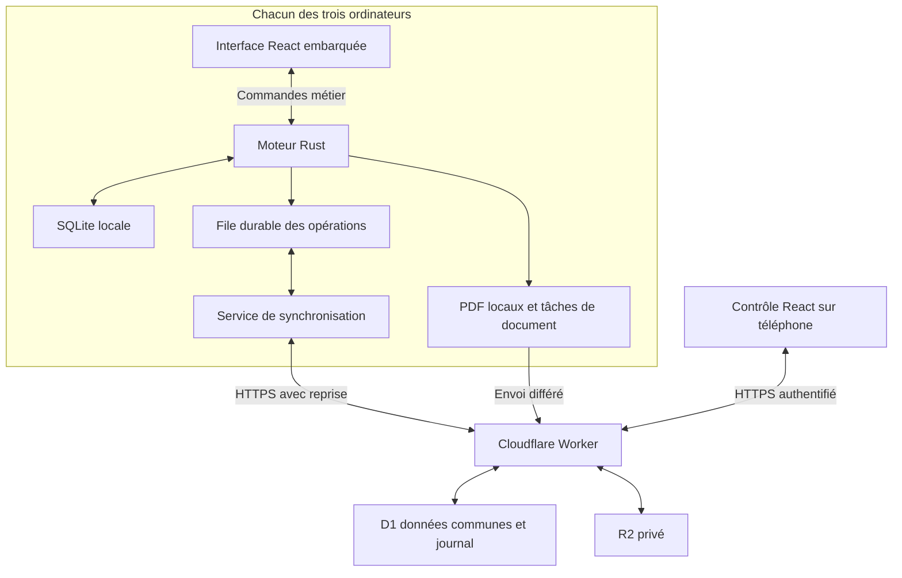

# Architecture de facturation pour trois ordinateurs et un réseau instable

Document de décision et de réalisation  
1 octobre 2026  
Destinataires : responsable de l’entreprise et équipe de développement

## 1 Décision recommandée

Nous recommandons **Tauri 2 et React pour l’interface desktop, Rust pour le moteur local et SQLite sur chacun des trois ordinateurs**. Le contrôle mobile et une petite API seront hébergés sur **Cloudflare Workers**, avec **D1 pour les données communes** et **R2 Standard pour les PDF définitifs et les sauvegardes**.

Chaque personne travaille d’abord sur son ordinateur. Le programme démarre, consulte les comptes déjà reçus et enregistre les brouillons sans dépendre du réseau. Une file durable reprend les envois lorsque la connexion revient. Les numéros définitifs, les paiements verrouillés et les clôtures restent sous l’autorité du serveur.

**Pour trois PC indépendants et une seule série continue, la V1 prépare les factures hors connexion mais les émet définitivement en ligne.** Une facture déjà émise et reçue sur le PC peut être réimprimée sans Internet. Si l’émission définitive hors connexion devient obligatoire, il faudra choisir un seul poste émetteur ou des séries distinctes par poste. Réserver des plages peut laisser des trous dans une série globale.

Nous visons douze mois sans coût d’infrastructure sous les hypothèses de volume indiquées dans ce document. Les quotas gratuits n’expirent pas automatiquement après six mois ; leur dépassement et les conditions du fournisseur déterminent les coûts.

**État actuel du projet.** Le dépôt contient un prototype React avec stockage de navigateur et simulation du contrôle. Le moteur desktop, la synchronisation réelle et la base authentifiée ne sont pas encore réalisés. Les performances présentées ici sont des objectifs, pas des résultats mesurés.

## 2 Besoins retenus

- Une entreprise, trois personnes et trois ordinateurs différents.
- Un format de facture avec bannière et pied de page ; pas de pièces jointes ajoutées librement.
- Interface française, clients réutilisables, lignes multiples, taxes, avances, avoirs et clôture mensuelle.
- Paiements Banque, Espèces, MTN Mobile Money et Orange Money.
- Un responsable consulte les clients sur téléphone et adresse des demandes à l’équipe.
- Un paiement verrouillé est validé et ne peut plus être modifié directement.
- Internet peut être lent, intermittent ou absent plusieurs jours.
- Windows 10 ou 11 comme cible initiale proposée, à confirmer sur les trois machines.
- Volume mensuel inconnu : les scénarios de calcul ne représentent pas une activité déjà mesurée.

Notre ordre de priorité est : préserver les saisies et les écritures financières, rendre le travail local réactif, réduire les échanges, puis optimiser les ressources mesurées.

## 3 Architecture générale



L’interface, les icônes, les polices nécessaires et le format sont embarqués sur le PC. Aucun téléchargement obligatoire au démarrage. Le site mobile partage les composants et contrats utiles, avec ses propres parcours.

Tauri sépare le processus Rust de la WebView ; Windows utilise WebView2. Nous conservons React pour réutiliser le design existant. Un exécutable plus petit ne prouve pas une consommation totale inférieure : mesurer Rust et les processus WebView ensemble. [Tauri — processus](https://v2.tauri.app/concept/process-model/)

| Partie | Choix | Responsabilité |
|---|---|---|
| Interface | React et build statique Vite | Écrans locaux et aperçu |
| Application | Tauri 2 | Fenêtre, installation et commandes natives |
| Moteur | Rust | Calculs, validation, fichiers et synchronisation |
| Base locale | SQLite avec rusqlite | Transactions et recherches |
| Réseau | Tokio et reqwest | Tâches asynchrones et connexions |
| API | Worker TypeScript | Droits, coordination et synchronisation |
| Base commune | D1 | Numéros, écritures et états |
| Documents | R2 Standard privé | PDF et sauvegardes |
| Identité web | Cloudflare Access | Identification des personnes autorisées |

Un Worker et une base D1 suffisent au départ. Nous ne proposons pas de microservices ni de serveur Node embarqué. Rusqlite fournit les transactions et l’API de sauvegarde SQLite ; ses appels synchrones seront isolés sur des workers dédiés. [Rusqlite](https://docs.rs/rusqlite/latest/rusqlite/)

## 4 Performance desktop

### Parcours de saisie local

React appelle des commandes telles que enregistrer_brouillon ou enregistrer_paiement. Il ne dispose pas d’un accès SQL libre ni des secrets réseau. Rust renvoie uniquement les données utiles à l’écran.

Le changement et son opération de synchronisation sont enregistrés dans une transaction SQLite courte. « Enregistré sur cet ordinateur » apparaît après le commit, sans attendre Internet. Un téléchargement de PDF ou une sauvegarde ne doit pas bloquer cette confirmation.

Le réseau est asynchrone. SQLite synchrone, compression et calcul lourd s’exécutent sur des workers distincts. Une fonction async contenant du travail bloquant peut encore ralentir son runtime. Limiter explicitement les tâches de calcul ; les tâches spawn_blocking déjà démarrées ne sont pas toutes annulables. [Commandes Tauri](https://v2.tauri.app/develop/calling-rust/), [Tokio](https://docs.rs/tokio/latest/tokio/task/fn.spawn_blocking.html)

### Limites de concurrence proposées

- Une fenêtre principale ; une surface PDF ouverte seulement pendant le rendu.
- Un worker d’écriture SQLite et au plus deux workers de lecture, chacun propriétaire de sa connexion.
- Un cycle de synchronisation de données à la fois par poste.
- Un téléversement de fichier à la fois, séparé de la voie des données.
- Une génération PDF à la fois ; sauvegarde et compression reportées au repos.
- Listes de 50 éléments, recherche indexée et pagination par curseur.
- Aucun chargement de tout l’historique ou rendu de tous les PDF au démarrage.
- Aucun transfert IPC de la base entière après une modification.
- Recherche temporisée de 150 à 250 ms ; brouillons sauvegardés après une courte pause et immédiatement aux actions explicites.

Les travaux attendent dans des tables locales et sont chargés par petites pages. La mémoire ne croît pas avec la file d’envoi. Les files en mémoire sont bornées. Une saturation entraîne une attente visible ; elle ne produit pas une fausse confirmation d’enregistrement.

### Objectifs à mesurer

Référence proposée : Windows, processeur à deux cœurs, 8 Go de RAM et SSD. Refaire les mesures sur les trois PC, surtout avec 4 Go ou un disque dur.

| Mesure | Cible initiale |
|---|---|
| Démarrage à froid jusqu’à l’écran utilisable | Au plus 3 s |
| Navigation locale après initialisation | P95 inférieur à 150 ms |
| Confirmation d’une petite écriture sur SSD | P95 inférieur à 200 ms |
| Recherche paginée dans 10 000 factures | P95 inférieur à 150 ms |
| PDF de 1 à 3 pages après disponibilité du rendu | Au plus 2 s |
| CPU moyen au repos sur 60 s | Inférieur à 1 % |
| Mémoire totale Rust et WebView stabilisée | Cible de 250 Mo à vérifier |

Ces valeurs sont des critères de qualification. Relever médiane, P95 et extrêmes sur le build de production. L’antivirus, le disque, les polices et WebView2 influencent les résultats. Aucune mesure ne doit justifier d’affaiblir la durabilité des paiements.

## 5 SQLite et résistance aux interruptions

Réglages de départ :

```sql
PRAGMA journal_mode = WAL;
PRAGMA synchronous = FULL;
PRAGMA foreign_keys = ON;
PRAGMA busy_timeout = 5000;
```

WAL permet aux lectures et à une écriture de progresser ensemble, avec un seul écrivain à la fois. NORMAL peut perdre une transaction lors d’une coupure électrique ou d’un crash système. Nous recommandons FULL pour les écritures financières. Cette protection dépend aussi du disque et du système ; elle ne couvre pas la perte matérielle du PC. [SQLite WAL](https://www.sqlite.org/wal.html), [SQLite synchronous](https://www.sqlite.org/pragma.html#pragma_synchronous)

La base reste dans le dossier local de données de l’utilisateur. Ne pas placer la base active dans un partage SMB ou un dossier synchronisé par OneDrive. Les trois PC échangent des opérations par l’API ; ils n’ouvrent pas le même fichier SQLite distant. [SQLite sur un réseau](https://www.sqlite.org/useovernet.html)

Conserver l’auto-checkpoint par défaut au départ. Observer la taille du WAL ; ajouter un checkpoint passif au repos si nécessaire. Ne pas lancer un VACUUM complet ou un checkpoint bloquant après chaque saisie. Fermer rapidement les transactions de lecture.

Une sauvegarde utilise Online Backup en étapes courtes, sur une connexion dédiée. Copier uniquement le fichier .db d’une base active en WAL n’est pas une procédure suffisante. [SQLite Backup](https://www.sqlite.org/backup.html)

Les montants sont stockés en unités monétaires entières. Taxes et arrondis suivent des règles décimales explicites. Rust et le Worker recalculent les totaux avec des exemples communs ; aucun flottant binaire pour le solde financier.

## 6 Modèle de données

Le serveur conserve des tables métier courantes et un journal de changements. Les écrans ne sont pas reconstruits depuis tout l’historique à chaque ouverture. Un audit conserve les décisions financières.

| Groupe | Données |
|---|---|
| Accès | Entreprise, personnes, rôles et installations |
| Clients | Coordonnées courantes et version |
| Facturation | Factures, lignes, avoirs, périodes et compteurs |
| Paiements | Montant, mode, date, validation et correction liée |
| Documents | Versions du format, PDF et état d’envoi |
| Demandes | Message, réception, lecture et traitement |
| Synchronisation | Opérations, résultats, journal et curseurs |

Chaque objet possède un UUID stable, distinct du numéro visible de facture. Une opération porte operation_id, device_id, version de base et version de protocole. L’auteur et l’entreprise sont dérivés de l’accès autorisé, pas simplement crus depuis le JSON.

SQLite ajoute la file outbox, le curseur reçu, les résultats et les tâches de fichiers. Séparer la version serveur des modifications locales en attente. Un paiement saisi localement n’est pas présenté comme validé.

Index de départ : entreprise et client, facture et date, période et numéro, operation_id, entreprise et séquence du journal. Utiliser une pagination par clé. Les soldes communs sont actualisés dans la transaction des paiements et avoirs, avec rapprochement des écritures.

D1 compte les lignes parcourues : compresser le JSON ne compense pas une requête qui scanne tout l’historique. Les index et petites réponses évitent ce gaspillage. [Tarification D1](https://developers.cloudflare.com/d1/platform/pricing/)

## 7 Synchronisation durable et sans double effet

### Écriture locale

1. Valider la saisie dans Rust.
2. Enregistrer le changement et l’opération dans la même transaction.
3. Confirmer l’enregistrement local.
4. Réveiller le service réseau.

Un arrêt après l’étape 2 laisse une opération que le prochain lancement retrouve. La fermeture du programme n’attend pas que tous les envois réussissent.

### Accusés et idempotence

Le transport peut livrer plusieurs fois. L’effet métier doit rester unique :

- Chaque tentative réutilise le même identifiant et le même contenu.
- Le serveur impose l’unicité de l’opération dans l’entreprise.
- Mutation, résultat et journal sont enregistrés atomiquement.
- Une opération déjà acceptée renvoie son résultat existant.
- Le même identifiant avec un contenu différent est rejeté.
- Le PC enregistre l’accusé durablement avant de retirer l’élément de la file active.

Un timeout peut survenir après un commit réussi. Le client ne sait alors pas si le paiement existe : il interroge ou rejoue la même opération. Il ne crée jamais une nouvelle identité pour « essayer encore ». Conserver les identifiants des émissions et paiements pendant la vie des écritures ; une purge trop rapide ferait réapparaître le risque après une longue coupure. [AWS — API idempotentes](https://aws.amazon.com/builders-library/making-retries-safe-with-idempotent-APIs/)

### Réception et premier chargement

Le serveur attribue une séquence aux changements acceptés. Le PC récupère la suite après son curseur, applique les données et avance le curseur dans la même transaction SQLite. Une interruption conduit à une relecture sûre.

Le curseur n’est pas une heure locale. Dates de réception, dates métier et ordre serveur restent distincts. Une horloge incorrecte ne doit pas faire disparaître des événements.

Le premier chargement est un instantané paginé avec un point de reprise cohérent. Le journal récupère ensuite les mutations survenues pendant le chargement. Si un curseur devient trop ancien, refaire ce chargement en préservant et réconciliant les opérations locales non confirmées.

### Routes proposées

| Route logique | Fonction |
|---|---|
| POST /api/sync | Petites opérations et changements depuis le curseur |
| GET /api/operations/{id} | Résultat d’une opération incertaine |
| GET /api/bootstrap | Instantané initial paginé |
| POST /api/invoices/issue | Émission et numérotation coordonnées |
| POST /api/payments/{id}/validate | Validation d’une version précise |
| POST /api/months/{id}/close | Clôture après coordination |
| PUT /api/documents/{id} | Téléversement privé identifié |
| GET /api/control/clients | Liste mobile paginée avec fraîcheur |

D1 primaire suffit au départ. Si des réplicas sont ajoutés, utiliser Sessions et bookmarks pour la cohérence après écriture. Leur bookmark ne remplace pas notre curseur de journal. [D1 Sessions](https://developers.cloudflare.com/d1/worker-api/d1-database/), [réplication D1](https://developers.cloudflare.com/d1/best-practices/read-replication/)

## 8 Réseau lent et tentatives échouées

### Petits échanges prioritaires

Valeurs initiales : lot de données de 32 Ko maximum avant compression et réponse de 64 Ko maximum. Réduire vers 8 Ko après des échecs répétés. Une grosse facture utilise sa commande dédiée ; on ne coupe pas une émission métier en morceaux qui pourraient être validés séparément.

D1 Free autorise 50 requêtes par invocation. Fixer un budget initial de 30 statements, lecture de réponse comprise. Le nombre d’opérations d’un lot dépend de leur coût SQL, pas seulement de leur taille. Les factures volumineuses exigent des insertions groupées et une limite de lignes vérifiée. [Limites D1](https://developers.cloudflare.com/d1/platform/limits/)

Priorité : paiements et données, puis documents, puis sauvegardes. Réutiliser un client reqwest pour son pool de connexions et limiter les nouvelles négociations DNS/TLS. [Reqwest](https://docs.rs/reqwest/latest/reqwest/struct.Client.html)

### Délais proposés

| Situation | Valeur initiale |
|---|---|
| Ouverture de connexion | Timeout de 10 s |
| Petit échange de données | Timeout total de 45 s |
| PDF de moins de 500 Ko | Timeout total de 120 s |
| Application active | Vérification environ toutes les 60 s |
| Application ouverte mais inactive | Vérification toutes les 5 min |
| Réseau en panne | Reprises espacées jusqu’à 15 min |
| Reconnexion ou sortie de veille | Une tentative anticipée avec décalage |

Ces valeurs devront être adaptées au réseau réel. Les actions restent enregistrées pendant l’attente ; le formulaire ne reste pas bloqué 45 secondes.

Après échec temporaire, progression proposée : 2, 4, 8, 16, 32, 60 secondes, puis intervalles plus longs. Ajouter un décalage aléatoire et une pause minimale. Une seule couche gère les reprises ; éviter leur multiplication entre runtime, client HTTP et service de synchronisation. Respecter Retry-After.

| Erreur | Traitement |
|---|---|
| Coupure, timeout ou panne 5xx temporaire | Retenter la même opération |
| 429 ou quota temporairement atteint | Espacer et conserver la file |
| 401 | Nouvelle authentification |
| 403 | Suspendre l’accès et expliquer |
| 409 | Résoudre le conflit métier |
| 422 | Corriger la saisie |

Une opération rejetée reste visible. Elle ne bloque pas les opérations indépendantes ; ses dépendances attendent. Le redémarrage conserve les délais de reprise, pour éviter une rafale après chaque relancement. Une interruption réseau ne produit pas une alerte répétée à chaque tentative. [AWS — timeouts et backoff](https://aws.amazon.com/builders-library/timeouts-retries-and-backoff-with-jitter/)

### Compression et comportement réel

Garder un JSON simple. Compresser les lots supérieurs à environ 8 Ko si le gain mesuré le justifie ; vérifier l’encodage supporté par le Worker et limiter la taille décompressée. Les petits paiements peuvent partir sans compression. Aucun PDF en base64 dans D1. La file est stockée sur disque : un long arriéré ne doit pas être envoyé d’un seul bloc. Limiter le débit de rattrapage, contrôler les dépendances et laisser passer les nouveaux paiements indépendants sans attendre tous les anciens documents.

À 64 kbit/s, 8 Ko prennent environ 1 seconde de transfert brut ; un PDF de 100 Ko prend environ 12,5 secondes, hors latence et pertes. Le responsable peut recevoir les paiements avant le document.

Le polling adaptatif suffit pour trois postes. Un WebSocket permanent et un protocole binaire ajouteraient une gestion de reconnexion sans gain démontré. Le signal « réseau disponible » du système ne prouve pas que notre API répond : seule une confirmation réussie actualise la fraîcheur.

## 9 Numérotation et clôture

Séries proposées : FA-2026-10-0001 pour les factures et AV-2026-10-0001 pour les avoirs. Le compteur est distinct par entreprise, période et type.

L’émission reçoit un brouillon figé et une identité d’opération. Dans une transaction D1, elle vérifie la période et les droits, attribue le numéro, enregistre les lignes et conserve le résultat. Toute erreur annule aussi l’incrément. Les contraintes uniques protègent contre deux requêtes concurrentes. D1 fournit des batches transactionnels. [Transactions D1](https://developers.cloudflare.com/d1/worker-api/d1-database/)

Une lecture préalable dans le Worker n’est pas un verrou : un autre poste peut agir avant la mutation. Les gardes de version et conditions métier doivent être imposées dans les statements ou contraintes de la transaction. Une UPDATE qui ne modifie rien ne provoque pas automatiquement un rollback ; la réalisation doit prévoir explicitement ce cas.

Le PC marque « Émise » après confirmation. Une réponse perdue laisse « Émission à confirmer » et déclenche la recherche du même résultat. Une facture annulée conserve son numéro et son historique. Un problème de génération PDF n’efface pas une émission réussie.

Pour clôturer, suspendre les nouvelles émissions du mois, demander un point de synchronisation à chaque poste, faire remonter les écritures restantes puis confirmer au serveur. Un poste absent empêche une clôture garantie complète. Une éventuelle clôture forcée exige une décision séparée du responsable et une règle pour les opérations tardives.

La clôture du mois de facturation n’interdit pas de recevoir ensuite un paiement sur une ancienne facture. Les factures restent immuables ; les paiements ultérieurs ont leur propre date.

## 10 Conflits et paiements verrouillés

Le solde serveur utilise les factures et avoirs émis ainsi que les paiements acceptés non annulés. Un paiement offline reste « En attente de synchronisation » ; il ne devient pas validé par une simple saisie.

Deux personnes peuvent saisir le même versement avec deux identifiants différents. L’idempotence réseau ne résout pas ce doublon métier. Contrôler la référence si elle existe, montrer les paiements récents et avertir sur montant, date et mode similaires. Ne pas fusionner automatiquement : deux versements réels peuvent être identiques.

La validation porte sur une version précise. Si l’écriture a changé, demander une relecture. Après verrouillage, rejeter les modifications et annulations directes. Une correction autorisée utilise une écriture distincte liée et auditée.

Une correction préparée offline avant réception du verrou est présentée en conflit. Elle ne remplace pas silencieusement le paiement validé. Clients et brouillons utilisent également une version de base ; montrer les versions concurrentes. Les créations de clients offline peuvent produire des doublons et exigent un rapprochement explicite.

## 11 Format unique et PDF

Conserver un seul format actif, mais garder ses révisions lorsque la bannière ou le pied de page change. Une facture émise référence sa révision et un instantané des coordonnées. Modifier une fiche client ne réécrit pas ses anciennes factures.

### Rendu local recommandé

Réutiliser le HTML de facture et exporter via WebView2 depuis Rust sur Windows. PrintToPdf est asynchrone et ne permet qu’une impression à la fois par WebView. L’intégration précise avec Tauri exige un prototype technique ; ce n’est pas une fonctionnalité garantie par le seul choix du framework. [Microsoft PrintToPdf](https://learn.microsoft.com/en-us/microsoft-edge/webview2/reference/win32/icorewebview2_7)

Attendre polices et images locales, écrire un fichier temporaire, contrôler le succès, puis publier le fichier final. Une erreur conserve la tâche à relancer. Vérifier pagination, longues lignes, marges et pied de page avant distribution.

Alternative à comparer si nécessaire : moteur PDF Rust direct pour le format fixe. Il peut éviter une surface WebView de rendu, mais impose de reproduire la mise en page. Choisir selon fidélité, temps, mémoire et taille mesurés ; « tout Rust » ne constitue pas un résultat de benchmark.

### Taille et envoi

- Texte vectoriel, pas capture d’écran de toute la page.
- Bannière dimensionnée une fois selon sa largeur imprimée et la lisibilité.
- Polices nécessaires uniquement ; sous-ensembles lorsque le moteur les permet.
- Objectif indicatif de 50 à 200 Ko pour une facture simple, à mesurer.
- Aucun nouvel envoi PDF lorsqu’un paiement change.
- Pas de recompression systématique d’un PDF déjà optimisé.

La bannière est référencée une fois dans les échanges de données, mais sera généralement intégrée dans chaque PDF autonome. Cette répétition dans les fichiers ne disparaît pas par simple référence au format.

Le PDF possède une tâche persistée avec identité, taille et SHA-256. Utiliser une clé R2 stable. Après un envoi incertain, vérifier l’objet avant de renvoyer. R2 dispose de checksums et d’écritures conditionnelles. [API R2](https://developers.cloudflare.com/r2/api/workers/workers-api-reference/)

D1 et R2 ne partagent pas une transaction : suivre « À générer », « À envoyer » et « Archivé ». Si l’objet existe mais que la confirmation D1 manque, la reprise termine l’état. Ne pas remplacer un PDF archivé par un autre contenu. Une empreinte vérifie les octets ; elle n’est ni une signature électronique ni une preuve de réception.

Pour les petits PDF, un seul PUT suffit. Le multipart ne sera ajouté que si des tailles importantes et interruptions mesurées le justifient. Aucun accès administrateur R2 n’est distribué aux PC.

## 12 Contrôle mobile et demandes

Liste simple, clients paginés, petits états et quelques actions. Charger le détail et le PDF uniquement à la demande.

Chaque poste communique dernier contact, dernière synchronisation complète, curseur et dernier nombre d’opérations locales en attente. Ce dernier nombre est daté : le serveur ne sait pas ce qui a été saisi depuis la dernière communication.

Afficher « Données potentiellement incomplètes » pour un poste ancien. Distinguer facture émise, remise déclarée et éventuelle réception confirmée. Un PDF archivé ou imprimé ne prouve pas une remise au client.

La demande suit envoyé, reçu durablement, lu, traité. Le reçu part après sauvegarde locale ; les accusés se rejouent sans doublon. Prévoir une prise en charge pour éviter deux traitements. Rattacher un paiement existant ou fournir une réponse ; la demande ne crée jamais automatiquement un paiement.

Sur téléphone sans réseau, présenter les données déjà disponibles avec leur date ; la V1 ne valide pas de paiement hors connexion. L’application desktop doit être ouverte pour synchroniser. Un onglet mobile fermé ne reçoit pas de push sans fonctionnalité dédiée.

## 13 Accès et installation

Cloudflare Access est proposé pour identifier les personnes sur le web et autoriser l’appairage. Son offre gratuite vise les équipes de moins de 50 utilisateurs. Les rôles métier sont contrôlés par le Worker ; Access ne décide pas seul qui peut verrouiller un paiement. [Cloudflare Access](https://www.cloudflare.com/zero-trust/products/access/)

Le PC crée une demande d’appairage temporaire, approuvée dans le navigateur authentifié. Le serveur fournit un accès propre à l’installation et à la personne. Code à usage unique, expiration courte, rotation et révocation. Ce flux précis doit être réalisé et vérifié avant la production.

Vérifier les jetons et leur destinataire, dériver l’entreprise et contrôler chaque commande. Protéger les mutations web contre les requêtes intersites. Conserver les secrets côté Rust dans le coffre du système, par exemple Credential Manager sous Windows, jamais dans React ou le dépôt. [Jetons Access](https://developers.cloudflare.com/cloudflare-one/access-controls/applications/http-apps/authorization-cookie/), [Microsoft CredWrite](https://learn.microsoft.com/en-us/windows/win32/api/wincred/nf-wincred-credwritew)

Une session expirée ne supprime pas les brouillons. Un poste révoqué ne synchronise plus, mais la révocation ne peut pas être connue immédiatement hors réseau. Prévoir comptes Windows individuels, protection du disque et sauvegardes chiffrées. SQLite n’est pas chiffré par défaut.

Limiter les capacités Tauri, ne pas autoriser des pages distantes à appeler des commandes natives et valider les textes et images du format. [Capacités Tauri](https://v2.tauri.app/security/capabilities/)

Fournir un petit installateur pour les PC déjà équipés de WebView2 et un paquet offline transportable par USB pour les autres. Tauri propose offlineInstaller, plus volumineux mais sans téléchargement obligatoire à l’installation. [Installation Windows](https://v2.tauri.app/distribute/windows-installer/)

Les mises à jour attendent la fin de la saisie et sont vérifiées avant installation. Sauvegarder avant migration et maintenir une compatibilité temporaire des protocoles. La signature Authenticode et un domaine personnalisé peuvent coûter indépendamment de l’hébergement.

## 14 Sauvegardes et restauration

- Chaque PC : sauvegarde cohérente quotidienne incluant sa file non envoyée ; sept copies locales.
- Serveur : export cohérent quotidien et manifeste des documents ; sept copies quotidiennes et quatre hebdomadaires.
- Support indépendant : copie chiffrée régulière, avec procédure de récupération des clés.
- Rotation des copies de sauvegarde uniquement ; pas de suppression des factures pour respecter le budget.

L’export contient un point de journal et les références des objets. Une restauration serveur change l’époque de synchronisation pour forcer la réconciliation ; les anciens curseurs ne sont pas supposés valides après retour en arrière. Suspendre alors les émissions et les validations. Rapprocher la sauvegarde avec les écritures confirmées encore présentes sur les PC et le manifeste des PDF ; retrouver les opérations et numéros émis après le point restauré avant de reprendre. Ne jamais repartir automatiquement d’un ancien compteur ni recréer de nouveaux identifiants pour des paiements déjà acceptés. Si l’état le plus récent ne peut pas être reconstitué, signaler les écritures manquantes au responsable et garder l’émission suspendue jusqu’à résolution.

Pour remplacer un PC : révoquer son accès, appairer le nouveau, récupérer l’état serveur puis restaurer les opérations locales avec leurs identifiants d’origine. Une panne matérielle avant sauvegarde et synchronisation peut perdre les dernières saisies. Le serveur ne peut récupérer ce qu’il n’a jamais reçu.

D1 Free fournit sept jours de Time Travel ; cette protection complète les exports, sans constituer une archive annuelle indépendante. [Limites D1](https://developers.cloudflare.com/d1/platform/limits/)

## 15 Budget gratuit sur douze mois

Quotas vérifiés le 1 octobre 2026 :

| Service | Allocation ou limite |
|---|---|
| Workers Free | 100 000 requêtes par jour ; 10 ms CPU par invocation |
| Assets statiques | Requêtes gratuites et illimitées lorsqu’ils sont servis comme assets |
| D1 Free | 500 Mo par base ; 5 Go par compte |
| D1 quotidien | 5 millions de lignes lues ; 100 000 lignes écrites |
| R2 Standard | 10 Go-mois ; 1 million d’opérations classe A et 10 millions classe B par mois |
| Transfert sortant R2 | Gratuit |

Sources : [Workers](https://developers.cloudflare.com/workers/platform/pricing/), [assets](https://developers.cloudflare.com/workers/static-assets/billing-and-limitations/), [D1 limites](https://developers.cloudflare.com/d1/platform/limits/), [D1 tarifs](https://developers.cloudflare.com/d1/platform/pricing/), [R2](https://developers.cloudflare.com/r2/pricing/).

Trois PC vérifiant une fois par minute pendant huit heures produisent 1 440 requêtes quotidiennes, avant les actions et le téléphone. Sur 24 heures, 4 320. Grouper les nouveautés évite plusieurs routes de polling indépendantes.

La limite CPU exige des échanges courts. Aucun rendu PDF ou compression complète sur le Worker. Observer le CPU réel, y compris la sérialisation et le travail lié à D1. Le faible trafic ne garantit pas le respect des 10 ms.

### Estimation du stockage

Hypothèses : 10 Ko par facture pour données, lignes, paiements moyens, index et journal compact ; PDF de 100 Ko ; onze copies serveur de taille égale à la base de fin d’année. Pas de gain de compression supposé. Ajouter une marge pour clients, format et installations.

| Factures par mois | Par an | Base estimée | PDF cumulés | Onze copies de base | R2 indicatif |
|---|---:|---:|---:|---:|---:|
| 100 | 1 200 | 12 Mo | 120 Mo | 132 Mo | 252 Mo |
| 500 | 6 000 | 60 Mo | 600 Mo | 660 Mo | 1,26 Go |
| 1 000 | 12 000 | 120 Mo | 1,2 Go | 1,32 Go | 2,52 Go |

À 1 000 factures mensuelles mais 25 Ko de données et 300 Ko de PDF, on atteindrait environ 300 Mo dans D1 et 6,9 Go dans R2, onze copies comprises.

Ces estimations ne remplacent pas une mesure. R2 compte les Go-mois ; le tableau montre le stock de fin d’année, pas une archive remise à zéro mensuellement. L’année suivante s’ajoute. Ne pas téléverser trois copies complètes supplémentaires de la même base chaque jour depuis les trois PC.

Prévenir vers 60 % puis 80 % des quotas. Suivre stockage, lignes, CPU, volume envoyé, profondeur des files et âge des accusés. Journaux techniques courts avec rotation, sans jetons ni contenu complet des documents.

R2 facture les dépassements ; une alerte n’est pas un plafond automatique. Imposer tailles de fichiers, budget de sauvegardes et marge de sécurité. Suspendre les copies supplémentaires avant les écritures ; garder les PDF localement si leur transfert doit attendre. Workers et D1 peuvent refuser des opérations au-delà des quotas ; conserver la file et informer.

Une URL workers.dev est disponible sans achat de domaine. Cloudflare recommande un domaine propre pour les services importants ; le sous-domaine gratuit permet de commencer sans engagement de disponibilité équivalent à un contrat. [Workers.dev](https://developers.cloudflare.com/workers/configuration/routing/workers-dev/)

**Estimation retenue :** douze mois à zéro coût d’infrastructure sont plausibles pour trois personnes et jusqu’à environ 1 000 factures mensuelles de taille raisonnable. Les métriques du pilote et les quotas en vigueur doivent le confirmer.

## 16 Scénarios de panne

| Scénario | Comportement attendu |
|---|---|
| Internet coupé après saisie | Changement et opération conservés localement |
| Commit serveur réussi, réponse perdue | Résultat retrouvé sans deuxième paiement ou numéro |
| Arrêt pendant réception | Transaction et curseur cohérents ; reprise sûre |
| PDF envoyé, accusé manquant | Objet vérifié et état réconcilié |
| Deux émissions simultanées | Numéros distincts dans la même série |
| Verrou distant et correction locale | Paiement validé préservé ; conflit visible |
| Même versement saisi par deux personnes | Contrôle métier, pas de fusion automatique |
| Poste absent à la clôture | Clôture normale bloquée avec explication |
| 429 ou panne serveur | Reprises espacées, travail local disponible |
| Session expirée | Nouvelle connexion sans perte des brouillons |
| Disque plein ou commit échoué | Aucun faux message « enregistré » |
| Horloge erronée | Ordre serveur et période contrôlés |
| Trois jours sans réseau et redémarrage | File retrouvée et rattrapage progressif |
| Perte du PC avant synchronisation | Récupération possible uniquement depuis sauvegarde disponible |

## 17 Plan de réalisation

### Lot 1 Contrats et preuve du rendu PDF

Fixer numéros, périodes, arrondis, droits et verrous. Relever machines, débit et volume. Prototyper WebView2 PrintToPdf sur le vrai format, relever fidélité, taille, mémoire et temps. Comparer un rendu Rust direct seulement si ce choix ne satisfait pas les objectifs.

Livrable : schéma, exemples de calcul et décision de rendu documentée.

### Lot 2 Application locale

Tauri, commandes Rust, SQLite, migrations, sauvegarde et file durable. Importer les exports réels du prototype en conservant identifiants, dates et numéros. Exclure les données de démonstration.

Livrable : application utilisable hors réseau pour consultation et brouillons, avec restauration documentée.

### Lot 3 Serveur et synchronisation

Worker, D1, R2 privé, identité, appairage et permissions. Réaliser opérations idempotentes, numérotation, versions, verrous et curseurs. Le compte Cloudflare de l’entreprise est distinct de l’hébergement Sites du prototype.

Livrable : trois installations qui convergent vers le même état.

### Lot 4 Contrôle réel et documents différés

Remplacer les simulations par le serveur réel. Ajouter fraîcheur, notifications, accusés, prise en charge et téléversement différé. Faire remonter les paiements avant les PDF.

Livrable : contrôle mobile clair, sans confusion entre données reçues et données encore inconnues.

### Lot 5 Qualification et distribution

Prévoir 64 à 256 kbit/s, latence de 500 à 2 000 ms, coupures répétées, réponses perdues après commit, 429/5xx et 72 heures sans réseau. Vérifier sortie de veille, arrêt du programme, redémarrage, stockage plein et restauration.

Contrôler concurrence des paiements, idempotence, versions, séries, mois clôturé, PDF multipage et dépassements de quotas. Les essais de coupure électrique réelle se font en environnement dédié, jamais sur les données de l’entreprise.

Cette matrice est le plan de qualification de la future application. Aucune de ces vérifications n’a été exécutée sur une implémentation desktop lors de cette recherche.

Condition de livraison : saisies durables, reprise sans double effet, conflits visibles, numérotation coordonnée, documents fidèles et restauration démontrée. Optimiser ensuite les ressources à partir de profils mesurés.

## 18 Décisions restantes

1. Volume réel, nombre de lignes, longueur des descriptions et fréquence des paiements.
2. Windows, RAM, disques et présence de WebView2 sur les trois machines.
3. Acceptation de l’émission définitive en ligne, ou choix d’une autre série.
4. Qui valide, corrige et clôture ; procédure après erreur sur un paiement verrouillé.
5. Format et règles de calcul définitifs, ainsi que durée de conservation métier.
6. Compte Cloudflare, identités autorisées et responsable des sauvegardes.

Le schéma, le moteur local et le prototype PDF peuvent commencer avant toutes les réponses. La règle de numérotation doit être arrêtée avant livraison de l’émission réelle.

## Sources et portée de la recherche

Les faits de plateformes sont reliés à leurs documentations officielles dans les sections. Les paramètres de reprise, objectifs de performance, contrats et budgets sont des recommandations propres au projet, à mesurer au pilote.

Références complémentaires :

- [Tauri communication entre processus](https://v2.tauri.app/concept/inter-process-communication/)
- [Tauri SQL et migrations](https://v2.tauri.app/plugin/sql/)
- [Cloudflare déploiement conjoint du site et du Worker](https://developers.cloudflare.com/workers/static-assets/)
- [Cloudflare Access politiques](https://developers.cloudflare.com/cloudflare-one/access-controls/policies/)
- [SQLite usages appropriés](https://www.sqlite.org/whentouse.html)

Recherche consultée le 1 octobre 2026. Vérifier une nouvelle fois fonctionnalités, quotas et tarifs au déploiement.
